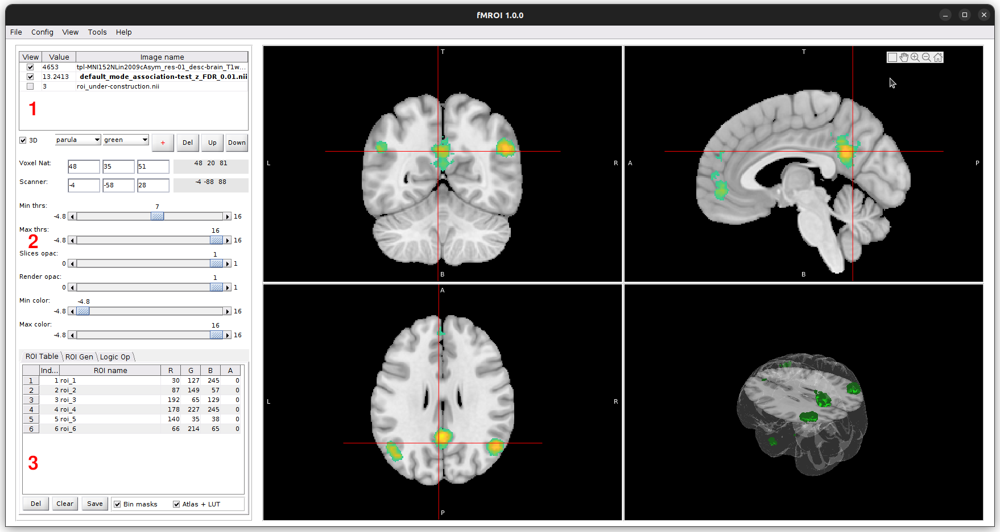

Overview
========

fMROI Graphical User Interface
------------------------------

The fMROI Graphical User Interface (GUI) is designed to provide users with a user-friendly and intuitive experience for creating Regions of Interest (ROIs) and visualizing neuroimages. The GUI consists of three main control sections:

1. **Listing table of loaded images:** In this section, users can view a table listing the loaded images in the order of overlay. It allows for easy selection of images, enabling or disabling their visualization, and provides the ability to view the value of the voxel pointed by the cursor.

2. **Control of image visualization aspect:** This section enables users to define various aspects of image visualization. Users have the flexibility to choose colormap, threshold, transparency, cursor position, and stacking order of images. These controls allow for customization and adjustment of the visual representation of the neuroimages.

3. **ROI generation and manipulation section:** This section is divided into three tabs: 

- **ROI Table:** Provides a detailed overview and management of the created ROIs, allowing users to easily modify and organize them.
- **Gen ROI:** Offers tools and functionalities for generating ROIs, simplifying the complex process with user-friendly options.
- **Logic Op:** Enables users to perform logical operations on the ROIs, such as combining and selecting regions of interest. This feature enhances the versatility of the software for neuroimage analysis.

The fMROI GUI aims to streamline the workflow of ROI creation and manipulation, providing researchers with an efficient and comprehensive tool for their neuroimage analysis needs.

Loading Images
--------------

fMROI offers three methods for loading images into the software:

1. **Open NIfTI files:** Clicking on "File > Open" opens a window that allows you to select the images you want to load. The images must be three-dimensional NIfTI files (.nii or .nii.gz). If a 4-D NIfTI file is selected, fMROI will display a warning indicating that only the first 3-D volume from the 4-D array will be loaded. You can select multiple files to be opened at once using this method.

2. **Load templates:** By selecting "File > Load Templates," you can choose from a range of preinstalled templates. These templates include anatomical images, functional maps, and atlases.

3. **Load ROIs:** Clicking on "File > Load ROI" opens a window that allows you to select a ROI file. The ROI file should be a three-dimensional NIfTI file (.nii or .nii.gz). Upon loading the ROI file, fMROI generates a temporary image called "roi_underconstruction.nii," and the ROI is displayed in the "ROI Table" tab. If the loaded ROI image contains multiple ROIs (i.e., if the image is not binary), fMROI will convert the image values to positive integers. Each set of non-zero values will be considered as an independent ROI.

After loading an image using any of the three available options, an entry is generated in the fMROI table of loaded images. The image presentation in fMROI is similar to other neuroimage viewers such as FreeView and FSLeyes, where each loaded image is represented as a layer. Consequently, all the loaded images are stacked on top of each other, and to visualize an image that is below others, you can hide the images on top by unticking the checkbox in the first column next to the image name (1.). Alternatively, you can adjust the transparency by decreasing the opacity in the control of image visualization aspect or apply thresholding to the top images using the Min and Max threshold controls. The images are stacked in the order they were loaded, with the last loaded image appearing on top. To change the order of the image stack, simply select the desired image (3. the name of the selected image will be shown in bold) and use the "up" button (4.) to move it up one level or the "down" button (.5) to move it down one level. Additionally, the pixel values of each image are displayed in the second column (2.), and you can remove a selected image by clicking the "Del" button (6.).

*Please note that in the fMROI table of loaded images, the top image is represented by the last line, while the bottom image is represented by the first line.*

